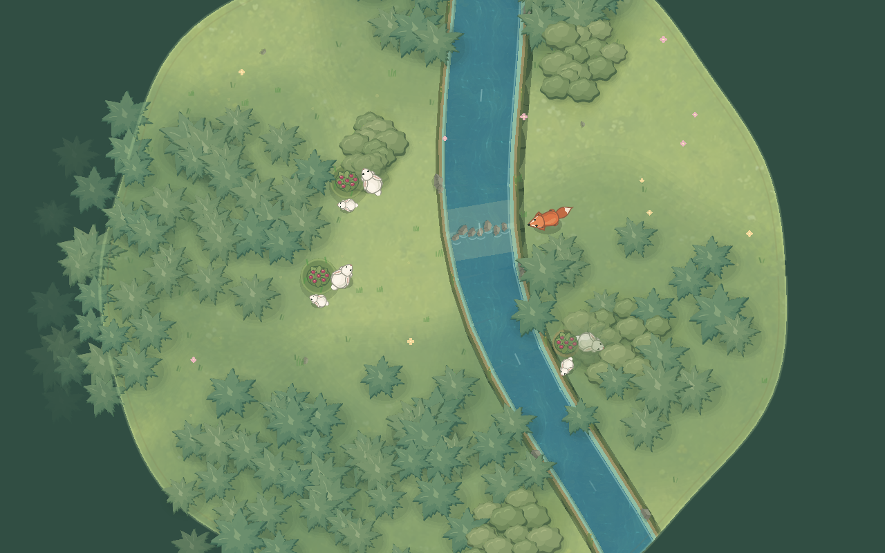

# Art and motion implementation — 22 September 2026

The [asset audit](audits/2026-09-22/ASSET_AND_MOTION_AUDIT.md) is now followed by a working, coordinated overhead art library. Three agents handled animal/forage artwork, motion integration, and habitat artwork; a separate review pass checked how their work fits the scene.

[Opening with HUD](playtests/2026-09-22/art-motion/opening-hud.png) · [Expanded view](playtests/2026-09-22/art-motion/expanded-map.png) · [Closer view](playtests/2026-09-22/art-motion/detail-map.png) · [Motion clip](playtests/2026-09-22/art-motion/motion.mp4)

## What changed

Rabbits now have shaped ears, haunches, forepaws and paired hind paws, with distinct rest, observation and feeding poses. Foxes have a tapered plume, pale cheek markings and alternating dark paws. Their trot follows actual distance traveled, with a restrained body rise. Both use the same overhead perspective as the new evergreen and thicket crowns. Juvenile scaling and existing life-event indicators are preserved.

Rabbit movement-to-rest/feeding transitions retain the preceding airborne pose and settle within 0.20 simulation seconds. This changes the drawn pose while the feeding/rest position remains stationary. Danger still interrupts immediately. Fox tail, gait and a brief capture response use simulation time, so pause and speed controls affect them consistently. The capture response is presentation only; the existing meal/capture rules remain intact.

Trees, shrubs, food and animals now share one ordering by their ground positions. Shadows and habitat-quality footprints remain beneath them. Nearby crowns fade continuously on either side of their centers. Foliage layers are composited into cached transparent textures before fading, so their internal shading cannot accidentally accumulate into an opaque canopy over an animal.

The meadow uses a calmer base with faint painted grain. Forest and thicket washes have feathered, cached contours. Evergreen and low-cover silhouettes are distinct and share a restrained palette. The previous conifer atlas is retained on disk but is no longer used by the live renderer, removing its fringe/matte problem from the scene. Boundary trees now use fixed seeded anchors and reveal progressively during expansion.

Food assets match the new illustration style while keeping their lifecycle readable: depleted carrots are clipped, recovering carrots show shoots, and recovering/depleted berry bushes have no fruit. The separate ground footprint continues to communicate habitat quality.

[Animal pose study](playtests/2026-09-22/art-motion/animal-pose-study.png) · [Food lifecycle study](playtests/2026-09-22/art-motion/food-states.png)

## Validation

| Check | Result |
| --- | --- |
| Animal motion: landing continuity, interruption, distance-driven gait, two rises per trot cycle, equal-time 1×/3×, pause and capture timing | 16 passed |
| Existing rabbit activity checks | 12 passed |
| Core behavior suite | 58 passed |
| Terrain and routing suite | 13 passed |
| Lifecycle feedback interactions | 17 passed |
| Shared scenery depth, canopy visibility, fixed scenery anchors and juvenile sizing | 5 passed |

All 121 assertions passed. The focused motion/activity results were recorded in the agent's tool output; the other suite logs are archived beside the captures. Existing headless environment/certificate and resource-cleanup warnings remain in some logs; they are not assertion failures.

The main-scene motion fixture contains 240 prescribed 30 Hz frames: four video seconds at 1× and four at 3×, covering sixteen simulation seconds. It uses one rabbit, one fox and a berry bush on controlled flat terrain. It samples rabbit travel, feeding and socializing, and fox wandering; capture timing is validated separately by the motion test. Paused samples retain identical animal poses while the ambient/UI clock continues. The fox's image region is also pixel-identical across the one-second paused observation ([pixel comparison](playtests/2026-09-22/art-motion/pause-pixels.log)).

The opening/expanded/close views are staged at the normal camera scales. They are visual inspections, not completed playthroughs. Frame capture waits for deferred drawing before reading the viewport. [Validation metadata](playtests/2026-09-22/art-motion/validation.json), [telemetry](playtests/2026-09-22/art-motion/telemetry.jsonl), and [source fingerprints](playtests/2026-09-22/art-motion/source_hashes.json) identify the evidence.

## Extension points

See [ART_DIRECTION.md](ART_DIRECTION.md) for the drawing and animation contracts. Artwork is authored as vector/procedural assets, allowing smooth heading changes and articulation at gameplay scale. Habitat textures are generated once from that vector geometry, rather than introducing an external image-generation dependency.

The first pass preserves ecological and routing rules. Foliage is visual cover, so this does not introduce solid trunk collisions. Foxes still use the existing hunting/wandering behavior rather than a new feeding/rest state machine. Stationary rest-to-observe ear changes are immediate; these can receive a subtler blend in later animation polish. The captures establish rendering and timing behavior, not a production frame-rate budget or long-term ecosystem balance.

Reproduction commands are listed in the main [README](../README.md#tests). The visual fixture accepts an optional output directory, followed by `maps` to capture only map views.
