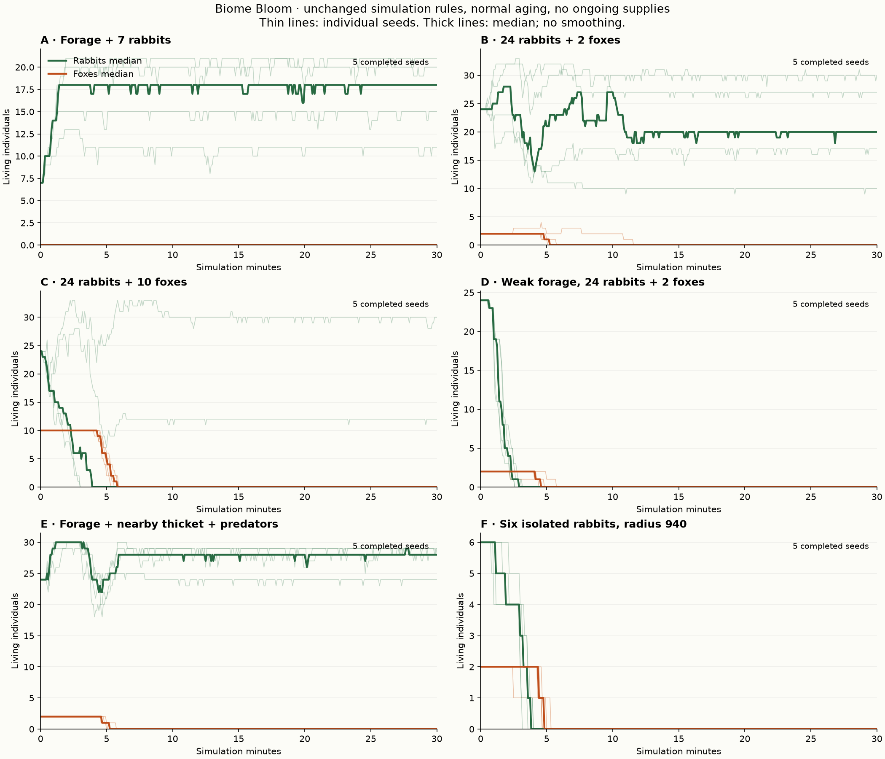

# Biome Bloom: gameplay and simulation audit

Audit of the current working tree, 17 September 2026. **No gameplay implementation changes.** Existing uncommitted changes were included in the audit and preserved.

**Recommendation: stay on Godot. Finish a convincing rabbit–forage–habitat–fox vertical slice before adding another animal.** The largest immediate weakness is the relationship between decisions, actions, and visible motion. There is also a separate, consequential ecological weakness: short-term predator/prey coexistence does not establish a self-replacing predator population.

The game already contains more ecology than its presentation suggests. Food depletion, recovery, terrain productivity, homes, hunger, escape stamina, pursuit failure, and reproduction constraints are real. The next step is to make those systems produce coherent animal activities, credible encounters, and demonstrated population persistence. Adding more rule-driven movers would multiply the present problems.

## Evidence and limits

This audit separates **observed rendering**, **measured simulation outcomes**, **code-derived causes**, and **proposed design**. Biological findings inform the proposals; they do not establish game tuning constants.

The installed executable reports `4.7.2.stable.official.ed1daf0bf`, using the Compatibility renderer on Apple M4. I launched the actual `game/main.tscn`, with its renderer, camera, HUD, simulation, inventory, and progression. Temporary drivers performed placements and supply choices using the existing playtest strategy and game APIs. This was automated play with inspection of captured frame sequences and individual telemetry, not an independent human usability session or an uninterrupted human viewing of every recorded frame.

Two opening layouts were investigated: a compact reactive colony, following Dandelion, and a distributed deliberate layout, following Fern. The first capture driver bypassed the supply panel's dismissal animation, leaving that panel visible after the first supply. macOS also stopped refreshing background-window captures in several attempts while telemetry continued. Obscured and stale images are excluded from visual evidence. The final capture drivers use the HUD's actual supply handler and explicitly draw the real main scene into a viewport before capture; sampled image hashes and changing positions verified fresh frames. The verified progression capture covers 296 simulation seconds: Fern was followed for 120, then the colony was observed at wider zoom. The 180-second controlled predator capture follows one fox for 90 seconds, then switches to the whole habitat. Its prepopulated sandbox uses unchanged animal rules; its HUD exposed an existing runtime error, noted below, while animal updates continued.

The deliberate progression strategy reached **A Nursery Network, checkpoint 4**, but did not complete it during the separate 1,800-second progression probe. This is evidence of that strategy's limits, not proof the game is unwinnable. Predator observation therefore comes from the explicitly identified controlled setup, not a claim to have unlocked foxes through that playthrough. [Capture sequences, recordings, raw data and reproduction instructions](evidence/README.md) document these distinctions.

Population trials run the actual `EcosystemSimulation.step(0.1)` without rendering or the progression director. There are no supplies, rescue bundles, checkpoint stops, or post-start interventions. Normal hunger, lifespan, reproduction, and population caps remain enabled. The primary experiment lasts 1,800 simulation seconds: roughly eight nominal rabbit lifespans and five fox lifespans. This establishes finite-horizon persistence or failure, **not mathematical equilibrium or indefinite survival**.

Seeds: `240817`, `9327`, `401`, `9031`, `17117`. They vary both terrain and animal randomness. A paired cover experiment holds plant productivity and initial positions constant. An additional pairing experiment separates encounter scarcity from mate isolation. Full setup code, layouts, curves, counts, and logs accompany this report.

## Controlled population results

Each primary scenario ran for 30 simulation minutes across five seeds. A–D use generated terrain; E uses a controlled flat habitat; F uses a larger generated biome. Positions are recorded in the raw summaries. Food is two-thirds carrot patches and one-third berry bushes. A–E have radius 600; F has radius 940. These are starting conditions, not claimed optimal ecosystem layouts.

| Scenario | Starting conditions | Result at 1,800 seconds | Interpretation |
| --- | --- | --- | --- |
| **A: food + rabbits** | 12 patches, 7 rabbits, no foxes; three food centres. | All five rabbit populations persist; **11–21** rabbits remain. No starvation deaths. | Bounded turnover under the existing reproductive capacity gate. No runaway growth; this is not evidence that purely local energy constraints discovered the ceiling. |
| **B: small predator population** | 18 patches, 24 rabbits, 2 foxes; three centres. | Rabbits persist in all seeds; final range **10–30**. Foxes disappear in all seeds, by **303–693 seconds**. Only seed 401 produces fox births: three, followed by eventual lineage loss. | Early coexistence masks weak predator recruitment. In these runs, all fox deaths are age deaths, not starvation. |
| **C: predator overstock** | Same food/prey layout as B; 10 foxes. | Rabbits go extinct in **3/5** seeds. Two remnants recover to 12 and 30 rabbits after predator decline. All fox populations disappear by **315–352 seconds**; no fox births. | Collapse is possible but not inevitable. Predation and interrupted feeding both matter: 9–12 rabbit starvation deaths occur in the three collapse runs, alongside 18–22 kills. |
| **D: weak food supply** | 3 patches, 24 rabbits, 2 foxes. | Both species extinct in **5/5** seeds. No rabbit births; **20–22 rabbits starve**, versus only 2–4 kills. | Strong bottom-up limitation. This is principally a forage failure, not evidence that foxes are universally too efficient. |
| **E: food + nearby refuge** | 18 patches, 24 rabbits, 2 foxes; three nearby thickets. | All rabbit populations persist, ending at **24–29**. All fox populations disappear; no fox births. | Refuge changes hunting, but does not establish a self-replacing predator population. See paired control below. |
| **F: sparse, distant prey** | 18 patches at six stations around radius 640; one rabbit per station, 2 central foxes. | Both species extinct in **5/5** seeds; no births. Foxes make just 1–4 kills per run. | Sparse encounters are not the only cause: rabbits also lack nearby mates. A pairing control is essential before blaming predation. |

Thin lines show individual seeds; thick lines show the median. Read individual lines in C: its median collapse hides two recovering populations. [Remaining resource stock](evidence/resource_curves.png) distinguishes forage pressure from population loss followed by resource recovery.

### Controls that change the interpretation

**Cover versus no cover:** E and `E_open` share the same flat terrain, exact initial plant/animal positions, seed, and plant capacities/productivity. Plants are created before adding E's thickets, isolating animal movement/refuge effects from plant suitability. Cover produces **5–6 kills per seed versus 7–9 without cover**, a reduction in every matched seed. But E also produces **1–4 starvation deaths versus zero without cover**. Final rabbit counts are higher in two seeds and equal in three; fox recruitment fails in both treatments. Cover helps escape while potentially drawing frightened animals away from feeding. The death counts are measured; interrupted feeding as the cause is a code-supported interpretation, not an isolated causal experiment on that one mechanism.

**Isolation versus pairing:** `F_pairs` retains F's six rabbits, food, world size, and foxes, but puts the rabbits in three pairs at alternate food stations. **Four of five rabbit populations now persist**, ending at 4–7 rabbits and producing 34–60 births; one still fails. Foxes disappear in all five. Thus “sparse prey all died” would be a misleading diagnosis without checking reproduction opportunity.

**More food and more compact food:** two exploratory single-seed trials use seed 240817. Doubling B's patches to 36 leaves 20 rabbits but still no fox births; both founder foxes die of age. A richer compact layout does allow **three fox births**, yet both species subsequently disappear. It records 41 rabbit starvation deaths, 11 kills, and 13 age deaths across founders and offspring; resources refill after extinction. More global food and more encounters are not sufficient if animals cannot feed safely. These are useful counterexamples, **not multi-seed estimates** of either layout's reliability.

[Control curves](evidence/control_curves.png) include all five cover/pairing seeds and the two single-seed explorations. Altogether: **42 completed trials, 21 aggregate simulation hours**. Interrupted exploratory second seeds are excluded.

### Why fox replacement is failing

A replay diagnostic of B's exact layout in seed 240817 found about **54.4 seconds when both foxes were individually eligible**, but **no sampled time with that eligible pair within mating route distance**. They can survive and eat without arranging a meeting. Seed 401, which produces three births, has only about 3.1 sampled pair-seconds of nearby eligible partners; about 1.7 also pass the local prey-density gate. These are post-step readiness samples, not exact counts of birth opportunities; the distinction still identifies mate encounter and local gating as important bottlenecks.

Foxes currently hunt or roam woodland; they have no purposeful mate/home rendezvous. Recent-intake eligibility is short, mating requires proximity, and the local prey-per-fox threshold adds another simultaneous constraint. Simply reducing kill efficiency could worsen recruitment. Diagnose and tune sustained condition, meeting opportunity, and density constraints together.

**Ecological verdict:** these trials demonstrate bounded herbivore populations, food-driven collapse, predator-overstock collapse, occasional prey recovery, and frequent predator replacement failure. They do **not** demonstrate a durable two-species equilibrium or a repeatable predator–prey cycle. Every tested predator lineage eventually disappears; that is a result for these layouts and seeds, not proof extinction is inevitable under every possible placement. No trial approaches the normal hard population caps. Seed variation meaningfully changes outcomes, but five seeds do not establish whether randomness is excessive. The qualitative failures have identifiable spatial and reproductive mechanisms, so adding noise is not the first remedy.

## Where the illusion of life breaks

| Observation | Evidence and interpretation |
| --- | --- |
| Rabbits slide into and through feeding positions. | The compact run recorded Dandelion's median sampled speed while labelled `eat` at **39.8 world units/s**, comparable to the configured 38-unit/s ordinary travel speed. Median recorded eating bouts were about **0.3 seconds**. The rabbit has a valid feeding decision; the action never establishes a settled feeding pose. |
| “Loafing” and “gathering at home” look like circulating. | Dandelion's median sampled speeds were 5.1 in `loaf` and 4.8 in `socialize`; fewer than 5% of samples in either state were below 1 unit/s. In the verified 120-second Fern run, `eat` has median speed 40.3 and `socialize` 7.4; none of those samples is stationary. These labels describe low-speed steering, not rest or social actions. |
| The colony becomes overlapping white discs. | In the compact 120-second trace, another rabbit was within 18 world units of Dandelion in 56% of samples. Captured sequences show substantial silhouette overlap. This is a sampling statistic, not a collision rate; rendered bodies are larger than their centres' soft separation suggests. |
| Turning reads as rotating an icon. | Whole bodies, ears, faces, and even the local shadow offset rotate with velocity. There is no independent gaze, planted pivot, anticipation, or facing maintained through an action. Smooth interpolation exists, but smooth rotation alone is not animal posture. |
| A “hop” is difficult to perceive as a hop. | The body circle shifts by at most 0.5 local units perpendicular to travel. There is no whole-body lift, compression, leg action, landing, or corresponding change in forward displacement. The head and ears do not participate in that body wobble. |
| Hungry trips are highly repetitive. | Food is approached as a point, a few 0.1-second bites reduce hunger rapidly, then the animal resumes low-speed home movement. Individual random traits stop perfect synchronization, but the repeated activity pattern remains narrow. |
| Predation changes destinations more clearly than body language. | In the rendered predator trial, the fox tracks a specific rabbit and nearby rabbits move away or churn through cover. The fox has a moving icon and swaying tail; prey indicate danger largely through trajectory and arcs. There is no readable assessment, stalk, attack commitment, lost contact, recovery pose, or hiding. |
| Terrain looks richer than its available interactions. | Trees, grass texture, flowers, pollen, and water provide strong scenery. Only placed food patches are edible. A lush-looking area can therefore contain no usable food, and trees do not create individual navigable obstacles. This makes ecological shortages and movement through scenery harder to believe. |

The compact sample is intentionally a crowded layout, not proof that every colony overlaps equally. The second opening and the predator view demonstrate the same missing action vocabulary under different conditions. The movement measurements are samples from live rendering; exact bout counts can be affected by skipped samples. The underlying code makes the causes unambiguous. [Rabbit frame sequence](evidence/rabbit_sequence.jpg), [hunt frame sequence](evidence/hunt_sequence.jpg), and [focal-rabbit motion measurements](evidence/rabbit_motion.png) provide complementary visual and numerical evidence. In the verified predator trace, Russet VI abandons hunts at 24.2 and 51.6 seconds, resumes after roughly 3.5 seconds each time, then captures prey at 63.0 seconds. That is useful hunt logic with weak physical differentiation between its phases.

### The direct causes

In [rabbit updates](../../../simulation/ecosystem_simulation.gd#L714), the code computes a route velocity towards the food and calls `_consume_plant` once within 13 units. Consumption sets `behavior = "eat"`, but **does not replace that velocity with a feeding action**. Separation and habitat steering are subsequently added, then movement runs normally.

In [home movement](../../../simulation/ecosystem_simulation.gd#L966), `loaf` and `socialize` both call the wandering motor. The latter means the animal is reproductively eligible and gathering near an anchor; it does not mean it is interacting with a selected partner. Constant gentle motion is built into the quietest activities.

At ordinary thresholds, hunger falls from about 20 to 11 at a net rate of `4.5 × 7.5 − 1.45 = 32.3` hunger units/s: approximately **0.28 seconds**, before travel, individual thresholds, and other costs. This is why a feeding visit can finish in three fixed ticks. Merely adding a long chewing animation would contradict resource consumption and the animal's subsequent movement.

In [animal drawing](../../../rendering/world_view.gd#L682), orientation is the interpolated velocity angle. [Rabbit drawing](../../../rendering/world_view.gd#L713) uses `sin(visual_clock * (5.5 + moving * 4.0) + id)` for the tiny body offset. Multiplying absolute time by a changing frequency can also introduce phase jumps when speed changes. `visual_clock` advances in real time, while world movement uses simulation speed, so cadence does not stay coupled to travel at 2×/3×. These are implementation choices, not demonstrated animation-engine failures.

## What the animal AI actually is

It is a **priority-driven state machine with timer-gated decisions, scored target selection, cached routes, continuous steering, and seeded randomness**. It is not just random wandering, but neither is it a general needs/utility planner. Randomness varies individuals and outcomes; most action transitions are deterministic consequences of thresholds.

| Decision | Current mechanism | Artificial result or important limit |
| --- | --- | --- |
| When to move | Almost every live state produces a desired velocity. | No genuine rest, vigilance, stationary feeding, or recovery activity. |
| Where to wander | Smoothed random angular changes, habitat bias, boundary steering. Foxes also seek woodland patrol points. | Curved motion exists, but exploration has little remembered purpose beyond food/home. |
| How fast | State speed, individual rabbit speed scale, exponential steering response, terrain factor; stamina changes escape/pursuit speed. | This is a smooth continuous motor. There is no gait-driven burst/rest structure or separate acceleration/braking model. |
| Which food | Route distance + target crowding penalty − stock bonus. Keep a valid target until it fails or appetite ends. | Good stability and distribution, but no diet distinction, feeding spot, safety tradeoff, or cost of interrupting a feeding bout. |
| How food is perceived | Local radius 175; connected groups within 50 units instantly share all member food sightings. Food memory lasts 90 seconds. Failure expands search to 455 units; starvation can expand it to 1,400, bounded by world diameter. | Social information has unlimited instantaneous chain propagation. “Searching harder” becomes knowledge of distant currently available patches, not more actual exploration. |
| Start/stop eating | Enter radius 13 and consume 4.5 biomass/s; appetite persists down to hunger 11. Depleted patches normally latch unavailable until recovering enough. | Hysteresis is useful. Feeding is nevertheless a brief moving contact, and the `meals` counter counts bites/ticks rather than complete meals. |
| Reproduce | Mature, fed, cooldown ready, nearby eligible mate, local biomass/stock, calculated local and global carrying-capacity gates. Birth costs biomass and parent energy proxy. | Real costs exist, but animals effectively consult a global resource budget. Pairing is instantaneous and not sexed; no gestation, nest investment, dependency, or parental care. |
| Detect danger | Closest ground-reachable fox, threat radius modified by caution, hunger, previous flee state, and possible refuge. | No sight occlusion or alert phase. A distant reachable predator and an approaching predator are largely distinguished by distance, not observed intent. |
| Escape | Select reachable thicket, route to it, then choose local directions balancing cover and distance from the threat; otherwise steer directly away. | Cover is systemic. Inside it, rabbits continue evading rather than becoming concealed and potentially losing the hunter. |
| Stop fleeing | Threat falls outside release conditions, then return to appetite/home logic. | Detection/release hysteresis helps, but there is no cautious post-threat recovery or persistent local danger memory. |
| Social interaction | Repulsion, shared food vision, shared/inherited home anchors, gathering for mating. | These can form colonies, but there is no attention to neighbours, alarm response, affiliation, displacement, or actual interaction bout. |
| Hunt | Hungry fox scores reachable prey by distance, other fox claims, and cover; retains target. Finite sprint stamina and a 24-second pursuit timeout. | Useful target persistence and failed hunts. Claims coordinate foxes without visible communication; no observation/last-known-position search model. |
| Recover from hunt failure | Avoid the last failed target briefly, wander for a rest interval, then try again. | “Rest” still moves. Failed pursuits increase subsequent speed, not just skill or route choice. |
| Stop hunting | A successful kill relieves hunger; a sufficiently fed fox roams until hungry again. | No prey-mercy rule was found. Satiation already constrains kills, but there is no handling, carcass, digestion activity, or locomotion energy expenditure. |

Relevant paths: [rabbit logic](../../../simulation/ecosystem_simulation.gd#L580), [fox logic](../../../simulation/ecosystem_simulation.gd#L783), [food selection](../../../simulation/ecosystem_simulation.gd#L1203), [reproduction](../../../simulation/ecosystem_simulation.gd#L1323).

### Predator balance: mechanisms that help, and mechanisms that undermine it

Keep hunger, satiation, finite pursuit, finite escape stamina, local forage costs, terrain-dependent speed/capture, and failed hunts. A fully satiated fox takes about `30 / 0.45 = 66.7` simulation seconds to reach its hunting threshold again. That is a legitimate consumption constraint, though not an explicit digestion state.

Three existing shortcuts deserve particular attention:

* **Scarcity weakens, rather than strengthens, encounter limitation.** Fox search radius grows from 260 towards 1,560 units as hunger rises, bounded by world diameter. Once acquired, the target's exact current position remains available. A starving fox can discover prey across most of the biome without traversing and searching that area first. This does not eliminate all failed encounters, but it substantially weakens spatial rarity and concealment.
* **Failure creates a large hidden speed subsidy.** The learning bonus reaches 56%; hunger can multiply speed by another 1.30. The combined upper multiplier is 2.028: a configured 78-unit sprint can request roughly 158 units/s before terrain. This is not simply the original finite sprint becoming more skilful. It also matters to capture reliability at a 0.1-second tick.
* **Reproduction uses omniscient population accounting.** Rabbit fertility is limited by an explicit calculated local/global capacity. Fox birth checks require enough reachable rabbits per projected fox. These are different from predator mercy—foxes still hunt scarce prey—but they are direct population gates, not entirely emergent physiology. The fox gate can block replacement precisely when a mature predator cohort needs successors.

Do not remove these constraints together and hope for balance. Replace them incrementally with bounded perception, search time, energy gained/spent, sustained condition for reproduction, mate/home behaviour, and habitat-mediated escape. Run matched trials after each change. A territory needs to regulate access or encounters; a decorative patrol waypoint is not a territory.

## Biology worth translating into this game

Use the European rabbit as the working reference: it fits the colony/home/refuge direction. Do not mix conclusions about every rabbit and hare species into one supposedly universal model.

| Research finding | Visible translation | What to leave out for now |
| --- | --- | --- |
| Rabbit locomotion has coupled hindlimb propulsion and distinct stance/propulsion phases. A small laboratory biomechanics study supports bounding/half-bounding, not a smooth sliding body. | Short foraging hops, committed travel bounds, and urgent escape bounds with readable takeoff and landing. | Exact joint forces, laboratory stance durations, and real-world metres/second. The cited work does not establish field acceleration or turning constants for this game. [Hall et al., 2022](https://pmc.ncbi.nlm.nih.gov/articles/PMC9208372/) |
| Grazing patch use is not explained by biomass alone; vegetation structure affects preference and patch residence. | Stay in a useful patch, take several bites, shift feeding position, assess a competing patch only when there is a reason. | Recreating experimental sward-height response curves or copying real feeding durations into a compressed game clock. [Iason et al., 2002](https://besjournals.onlinelibrary.wiley.com/doi/abs/10.1046/j.1365-2435.2002.00640.x) |
| Rabbits exposed to fox odour increased vigilance in a semi-natural experiment, without simply abandoning all ordinary activity. | A cheap alert state: stop, orient ears/head, assess, then resume or escape. Background risk changes frequency, not an endless panic flag. | A complete chemical scent-diffusion simulation. [Monclús et al., 2006](https://onlinelibrary.wiley.com/doi/10.1111/j.1439-0310.2006.01275.x) |
| Field observations link cover, grouping, relaxed behaviour, and predator pressure, with context-dependent results. | Prefer resting near shelter; weigh safety against forage; allow nearby animals to influence vigilance without demanding a flock. | A universal rule that more cover or a larger group is always safer. [Tobajas et al., 2024](https://link.springer.com/article/10.1007/s42991-024-00398-3) |
| Cover can obstruct detection and movement for both prey and predators; its geometry matters. | Break sight/contact in dense cover and search around last known locations. An accessible refuge can protect prey while reducing access to food. | Absolute invulnerability zones. [Blanchard et al., 2016](https://pmc.ncbi.nlm.nih.gov/articles/PMC4793317/) |
| Food availability can alter home-range use. | Keep the existing home anchor, but make residency respond to sustained local food and safety, allowing an exhausted home to be abandoned. | A full territorial/dominance simulation. [Food supplementation and home ranges, 2019](https://www.sciencedirect.com/science/article/pii/S1616504718302751) |
| Wild rabbit diets include grasses and other plant categories, with habitat/seasonal variation. | Make edible vegetation visually legible and distinguish low, widespread forage from richer concentrated patches when the slice is ready. | Dozens of plant species or digestive nutrient bookkeeping. [Habitat and food preferences, 2024](https://pmc.ncbi.nlm.nih.gov/articles/PMC11255995/) |
| Camera-trap work finds crepuscular activity and seasonal variation; rhythms are flexible. | Start with individual activity/rest cycles. A shared dawn/dusk modifier could later add a visible rhythm. | Day/night, seasons, weather, and sleep physiology before basic pauses and foraging work. [Caravaggi et al., 2018](https://pmc.ncbi.nlm.nih.gov/articles/PMC6252065/) |

These sources support the **form** of behaviours, not a prescribed number of hops, seconds of vigilance, or target weights. Those are design hypotheses to judge at the normal camera scale.

### A small implementable behaviour model

Keep a priority layer for urgent escape, physiological needs, and home intent. Under it, give each chosen activity a short-lived action with an explicit end condition. Score competing targets when needed; a general-purpose planner or large behaviour-tree framework is unnecessary.

A normal loop could be: notice/remember a patch → choose a reachable feeding spot → orient and perform a few hops → settle → bite/pause/check → shift within the patch → continue until sated, depleted, crowded out, or unsafe → choose a nearby resting spot. A warning can interrupt this with alert → escape → break contact/reassess → cautious resumption. The exact loop is not mandatory; the separation between **intent**, **action**, and **motion** is.

| Proposed behaviour | What players notice / why it helps | Simulation cost | Complexity and fit |
| --- | --- | --- | --- |
| Stable rest and brief vigilance | Quiet animals actually stop; ears/head orient before a decision. Activity becomes legible. | A timer, facing, and bounded local checks per animal. Low incremental cost. | Small–moderate. Existing states/timers support it; remove unwanted steering during committed stationary actions. |
| Gait-coupled movement | A hop moves the body; travel and escape have distinct cadence, distance, and posture. | Constant-size motor state; render interpolation between authoritative phases. | Moderate. Shared motor exists; add a locomotion profile and motion snapshot. No engine replacement needed. |
| Feeding bouts and local shifts | An animal settles, feeds, and works around a patch rather than touching its centre repeatedly. | A handful of feeding positions per patch and local occupancy checks. | Moderate. Plants already own biomass and consumers already retain targets. Consumption rate and feeding time must be co-designed. |
| Risk-sensitive patch/home choice | Similar food can produce different residence patterns near exposed ground and refuge. | Add cached safety/travel/crowding terms to existing scores; update at decisions, not every frame. | Moderate. Terrain, food memory, home anchors, and routes exist. Avoid making every rabbit pick one ideal point. |
| Alert, lost contact, and search | Fox searches a plausible area; a rabbit can escape perception and settle cautiously. | Local visibility checks and short memories; bounded search routes. | Moderate–large. Requires a perception layer, not just another state label. Preserve terrain routing. |
| Local social response | Neighbours pause or move after an alarm; crowded diners yield or select another spot. | Existing spatial hash plus short event memory. | Moderate. Do not implement society, hierarchy, or global coordination. |
| Condition-based breeding and habitat commitment | Fed adults remain near viable home/mate opportunities; births and later predator recruitment follow resources. | A slowly updated reserve/condition value, mate queries, and a reproductive action. | Moderate–large. Reuse current age, cooldown, lineage, and food costs; replace gates deliberately. |

## Motion assessment, separate from ecological AI

The correct destination can still look wrong. Conversely, animating a poor destination more beautifully does not repair it.

| Layer | Present | Recommended change |
| --- | --- | --- |
| Smoothing | Fixed 10 Hz simulation; position and angle interpolation; exponential velocity response. | Preserve this foundation. Feed it action-aware velocities and a stable facing signal. |
| Acceleration/deceleration | One exponential response to desired velocity for both. No explicit arrival envelope. | Separate launch, cruise, braking, and settle. Start braking for the chosen feeding/rest spot; do not chase a centre until overshoot flips the desired direction. |
| Turning | Body follows velocity; turn response varies by rabbit. | Limit turn rate according to gait; turn chiefly at landings/grounded phases; retain facing when stopped. Let eyes/ears/head attend independently. |
| Hop arc/cadence | Tiny lateral sine offset, driven by real time. | Accumulate gait phase, couple displacement to propulsion/flight, show body lift relative to grounded shadow, compress at landing. Scale with simulation time. |
| Stride and speed variance | Persistent individual speed/turn traits and smooth periodic pace variance already exist. | Keep individual variation; add purposeful short/long steps and state differences. More random noise would worsen intent. |
| Idle and feeding animation | No distinct rest, scan, grazing, grooming, or feeding posture. | A small set of recognizable poses at actual gameplay zoom. Grooming is optional decoration after rest/alert/feed are readable. |
| Transitions/blending | Behaviour changes immediately; renderer mostly changes arcs/tint. | Actions finish on useful phase boundaries unless urgent danger interrupts. Blend body posture while keeping contact/motion consistent. |
| Local avoidance | Rabbit-only soft repulsion; reduced during home states. No hard footprints or fox separation. | Use consistent body radii and short-horizon local avoidance; reserve feeding space. Permit brief contact, not indefinite interpenetration. |
| Navigation | Custom direct/ford waypoint routing; current waypoint radius 17; moving prey replan after 34 units and 0.55 seconds. | Add arrival-aware following and safe corner smoothing. Verify every smoothed segment stays on traversable ground. Measure stalls/turn reversals rather than replacing routing by assumption. |
| Obstacles | Deep water/boundary constrain movement; trees are primarily drawn decoration. | Decide which habitat features are permeable vegetation and which are actual obstacles. Keep visuals and occupancy rules consistent. |

The current router is a useful bounded solution for **one stream with known fords**. It is not a general pathfinder around arbitrary rocks, walls, multiple water bodies, and dynamic obstructions. If those become requirements, introduce an actual graph/navmesh behind the existing route API. Godot's navigation system has not been implicated by these observations because the game does not use it for these routes.

## Environment and ecological richness

**Removing the animals does not leave literally nothing happening.** Depleted plants refill, change lifecycle state, and eventually become abundant. Water and pollen animate. But once plants refill, ecological change stops: terrain suitability and capacity remain fixed, vegetation does not spread, compete, die, or modify habitat, and no other resource cycle develops.

That contributes to the board-like feeling. The world already affects animals; animals mostly affect a few isolated biomass counters. Strengthen that feedback before adding weather or nutrient chemistry.

| System | Current assessment | Next useful depth |
| --- | --- | --- |
| Food placement/density | Player-placed patches, minimum placement separation, no spontaneous establishment. | Treat each patch as an area with edible stock/feeding positions; maintain useful differences between concentrated forage and background vegetation. |
| Depletion/regrowth | Continuous biomass, terrain-scaled linear regeneration, visible lifecycle, recovery latch and emergency grazing. This is genuine simulation. | Let repeated grazing visibly change the footprint and recovery opportunity. Avoid a new global “grass” stock that hides local shortages. |
| Patch competition | Rabbits compete for food and targets. Plants do not compete with each other. | Only add local establishment/spread limits if they create a player-visible choice between food, cover, and space. No soil-chemistry prerequisite. |
| Habitat | Meadow/woodland/thicket affect productivity, roaming, refuge, movement and capture. | Make resting and ordinary forage decisions sensitive to habitat, and make cover affect detection/contact. |
| Water | A movement/placement barrier with fords, not thirst or plant hydrology. | Keep that role until drinking creates an interesting habitat decision. Water simulation is not necessary to fix today's problems. |
| Terrain edges | Berry suitability rewards margins, but animals mainly see scalar fields/routes. | Make usable shelter–forage edges recognizable in animal residence and feeding patterns. |
| Environmental feedback | Plants are drawn as stock states; decorative grass and trees persist unchanged. | Show clipped grazing zones, recovering fringes, and slowly changing patch extent. These must reflect biomass, not independently looped cosmetic growth. |

A modest later extension is a patch's regeneration and usable area responding to sustained grazing and nearby cover/competition. The player should be able to see a heavily used patch recede, a rested patch recover, and residence shift. Do not simultaneously add plant genetics, seasons, decomposers, water chemistry, and succession.

## A practical richness framework

Judge richness through four questions: **Can I read the animal's intent? Does the activity have a convincing physical form? Does it change local opportunities for another organism? Do the resulting patterns persist or change for explainable reasons?** More states or more species are not measures of richness.

| Area | Current behaviour | What feels wrong / cause | Better experience and recommended change | Impact | Complexity |
| --- | --- | --- | --- | --- | --- |
| Locomotion | Smooth continuous steering. | Gliding; no grounded propulsion cycle. | Distinct forage/travel/escape gaits with real pauses. | Immediate and very high. | Moderate. |
| Individual behaviour | Hunger, age, home, food memory, traits. | Few activities; home states keep moving. | Rest, feed, inspect, relocate with meaningful duration. | Very high. | Moderate. |
| Decision making | Priority rules plus scored targets. | Distant certainty; narrow motivations. | Bounded perception and memory, safety/crowding costs, retained actions. | High. | Moderate. |
| Feeding | Biomass consumption and appetite hysteresis. | Moving contact and extremely short visits. | Feeding positions, settled bouts, small within-patch shifts. | Very high. | Moderate. |
| Predator response | Detection/release radii, stamina, reachable refuge. | Binary flee/resume; cover never hides an animal. | Alert, refuge entry, lost contact and cautious recovery. | High. | Moderate–large. |
| Predator behaviour | Claims, tracking, finite pursuit, satiation. | Search is often radius expansion; failure boosts speed. | Observe/search/stalk/pursue/handle/rest with energy costs. | Very high. | Moderate–large. |
| Social behaviour | Repulsion, shared vision, home gathering. | Overlap and orbital movement replace interaction. | Local alarm response and feeding/rest spacing. | High. | Moderate. |
| Resource dynamics | Local depletion and reliable recovery. | Renewable dispensers with fixed extent. | Spatially readable grazing and recovery, selective patch persistence. | High. | Moderate. |
| Terrain/habitat | Useful static fields and stream crossing. | Much visible scenery does not affect decisions. | Readable shelter/forage edges and contact-breaking cover. | High. | Moderate. |
| Population ecology | Hunger, mortality, births, explicit capacity/prey gates. | Apparent early balance can lose a trophic level at cohort turnover. | Sustained condition, reproduction opportunity, habitat constraints validated over generations. | Essential to the game. | Large, iterative tuning. |
| Animation | Procedural circles/polygons, wobble/tail sway, arcs. | Similar silhouette across activities and life stages. | Small pose vocabulary, physical gait, visible juveniles. | Very high at close range. | Moderate; art plus engineering. |
| Environmental life | Refilling plants and ambient motion. | Mature world settles into fixed scenery. | A visible local grazing–recovery feedback. | High over longer watching. | Moderate. |
| Player readability | Field notes, stock silhouettes, hunger rings, story feed, objective lens. | Labels promise actions the image does not show; bite counts read as meals. | Match names/events to complete actions; expose causes of failed hunts and local shortage. | High. | Small–moderate. |
| Emergence | Colonies, redistribution, failed pursuits, terrain effects, births/deaths. | Some desired patterns require missing perception, habitat or recruitment links. | Connect existing systems before multiplying content. | High. | Incremental, spanning the slice. |

## What can emerge now

**Already supported:** clustering near home/food anchors; spreading food demand between similar patches; abandoning depleted patches; emergency reuse of regrowth; inherited colonies; some hungry resettlement; routing across fords; thicket changing pursuit/capture; failed hunts followed by another target; food additions allowing more births; overstock collapse; starvation caused by predation pressure interrupting feeding; local populations failing to replace themselves.

Some of these outcomes are partly authored. The home attraction explicitly creates residency, while calculated carrying capacity explicitly stops births. That is acceptable scaffolding, but should not be described as the whole ecosystem discovering balance solely through energy and local interactions.

**Structurally missing:** hiding that makes a hunter lose knowledge; searching last known locations; meaningful plant succession or competitive patch formation; predator diets switching between prey/resource types; scavenging; territories that regulate predator density; mating/parental activities; spatially selective juvenile survival beyond age eligibility; a day/activity rhythm; recovery after total species extinction without new introductions.

**Possible but not established as robust:** long predator–prey oscillations, predator recruitment tracking prey booms, and autonomous recovery after a predator-driven crash that leaves a viable prey remnant. Population variation alone is not evidence of a functioning oscillatory food web.

## Architecture: extend it carefully

The project has the right broad separation: simulation state is independent of scene physics and rendering; the director owns progression; `GameSystems` owns player operations/time; a shared terrain model serves simulation and rendering; the spatial hash bounds many local queries. Keep those boundaries.

It is **not yet species-scalable without accumulating branches**. Rabbits and foxes have separate dictionaries, constructors, update loops, mortality/removal paths, eligibility/reproduction functions, public activity mapping, rendering, and inventory/UI dispatch. Plant identity is likewise used in suitability and renderer choices. Diet is implicit: rabbits eat any plant and foxes eat rabbits. The large simulation file mixes perception, motivation, steering, feeding, population budgets and narrative events.

Before a third animal, extract only these contracts:

1. **Species definition:** diet tags/edible resource categories, senses, body radius, locomotion profile, maturation/metabolism and reproduction policy, habitat weights.
2. **Animal state:** identity/lineage, age, reserves/hunger, current activity/action, perception memory, target/route, facing/motion phase. Typed resources/classes or typed data can replace brittle string dictionaries gradually.
3. **Reusable primitives:** choose food, approach a spot, rest/observe, flee to refuge, pursue, search last known position, feed, and evaluate reproduction readiness. Species may compose different primitives; do not flatten every animal into identical behaviour.
4. **Resource/habitat contracts:** edible stock and access positions, consumption, renewal, traversability, cover, suitability. A later carcass should be an edible resource, not another rabbit/fox special case everywhere.

The existing route API, signal/events, and renderer boundary can remain. Explicit species-specific drawing is reasonable; ecological rules spreading throughout unrelated modules are the concern. A giant ECS rewrite would not produce better feeding or a single convincing hop.

### Scale and determinism

Local queries are a good start, but “uses a spatial hash” does not mean linear cost under all densities. Connected social groups duplicate their complete group membership and shared food dictionaries for every member, which can approach quadratic work/storage in a large connected colony. Some home and birth operations scan all animals/plants. Every animal samples habitat in eight directions; moving threats and reproduction add reachability work. Large emergency radii can visit much of the spatial grid. Plants and animals are inserted twice per tick.

The renderer redraws immediate-mode terrain/details/plants/animals each visual frame and sorts animals. There is no claim here that rendering is the measured bottleneck; its costs need separate frame profiling. The existing 150-rabbit/30-fox test allows **2.5 seconds for ten ticks**, with reproduction disabled and flat terrain. Passing it is a useful smoke budget, not proof of smooth 60 FPS or 3× play.

The simulation is single-threaded. Mutable shared dictionaries, target claims, immediate consumption/captures, and one RNG make simply parallelizing per-animal updates unsafe and order-dependent. First use cached/staggered perception, shared group records, cached habitat/routes, and measured hot-path improvements. If scale requires threads, plan/read from a snapshot and resolve claims/consumption/events in a deterministic commit phase.

Fixed steps and seeded RNG support repeatable runs on the same build. They do not prove cross-platform lockstep determinism. Insertion/update order matters; rabbits move before foxes, while spatial entries were captured earlier in the tick. Float arithmetic and future concurrency need explicit treatment for replays/network determinism. `GameSystems.advance` caps catch-up and discards excess accumulated time, so overload can change wall-time progression even while individual steps remain fixed.

### Measured CPU cost

These are **headless simulation timings, not rendered frame rates**. The load harness uses generated terrain, radius 940, 10 warm-up ticks and 150 measured ticks of 0.1 seconds. Reproduction is disabled only in these load cases; normal movement, feeding, hunting and captures remain active. Other audit Godot processes were stopped temporarily during each benchmark and resumed afterwards. The machine was not a controlled performance lab, and repeated timings varied substantially. Population-sweep timings were collected with concurrent work and must not be used as performance benchmarks.

| Starting rabbits / foxes / plants | Layout | Median tick, ms | 95th percentile tick, ms | Measurement |
| --- | --- | --- | --- | --- |
| 50 / 10 / 40 | Spread across radius 640 | **31.7–53.2** | **55.8–98.3** | Two runs; 48 rabbits remain after captures. |
| 150 / 30 / 90 | Spread across radius 640 | **116.6–124.5** | **178.9–209.7** | Two runs; 144 rabbits remain. |
| 400 / 80 / 240 | Spread across radius 640 | **306.7–520.9** | **562.5–2,243.3** | Two runs; 363 rabbits remain. Large variation makes precise capacity prediction inappropriate. |
| 150 / 30 / 90 | Clustered within radius 70 | **388.7** | **1,002.9** | One run; 125 rabbits remain. Compare with the first dispersed run, not as a universal density multiplier. |

A 10 Hz simulation has a **100 ms average tick budget at 1×**, or about **33.3 ms at 3×**, before other work. A long tick on the rendering thread can also cause a visible hitch even when the average meets that budget. The 150/30 case exceeds the 1× budget in both measurements. The present implementation therefore **has a demonstrated scaling problem on this machine**; claiming that current architecture already scales would be unjustified.

A separate instrumented 50/10 replay timed the existing functions without altering their logic. It averaged 29.4 ms/tick, again illustrating timing variability. Of its accumulated measured step time, rabbit updates account for about **52%**, plant regeneration **33%**, fox updates **6.5%**, shared food vision **5.7%**, and spatial rebuilds **2.2%**. Habitat steering takes about **22%** and ground-route calls **6.9%**, **nested inside** the other categories; do not add these percentages together.

There is a particularly concrete implementation issue in [plant regeneration](../../../simulation/ecosystem_simulation.gd#L461): `plant.get("habitat_suitability", terrain.food_suitability(...))` evaluates the expensive fallback argument even when the cached value exists. This defeats the intended avoided computation. Repeated habitat sampling and connected-group duplication are other specific optimization candidates. Their expected improvements still need measurement; no optimization was implemented for this audit.

The evidence supports **profiling and fixing this implementation first**, with an explicit population/density/speed budget. It does not measure a Godot ceiling or establish that another engine would run the same design efficiently. [Raw timing logs and exact harnesses](evidence/README.md) accompany the result.

## Godot versus migration

**A — implementation problems:** the ineffective hop, real-time animation phase, no resting/feeding action, undersized soft spacing, velocity-only orientation, omniscient search, hidden speed subsidies, reproductive encounter/gating issues, static vegetation, and species-specific ecology. None requires switching engines. Current navigation and animal collision behaviour are custom code, so they do not demonstrate a Godot navigation or physics limitation.

**B — awkward but realistically solvable:** large GDScript dictionary workloads, reliable profiling across script/server/render costs, controlling many animated individuals, and moving simulation work off the main thread. Godot documents animation blending/state machines, navigation/avoidance, batching, profiling, and native extension paths. Scene-tree access is not thread-safe; the current scene-independent simulation is a useful starting point, but shared mutation still needs redesign. [AnimationTree](https://docs.godotengine.org/en/stable/tutorials/animation/animation_tree.html), [NavigationAgents](https://docs.godotengine.org/en/stable/tutorials/navigation/navigation_using_navigationagents.html), [thread safety](https://docs.godotengine.org/en/stable/tutorials/performance/thread_safe_apis.html), [CPU optimization](https://docs.godotengine.org/en/stable/tutorials/performance/cpu_optimization.html).

**C — potential future constraints, not proven migration triggers:** many thousands of fully perceiving, interacting agents at accelerated time; a need for deterministic simulation across platforms; demanding web/mobile CPU budgets; much more elaborate navigation and vegetation. GDScript cannot be assumed to handle any target population, and rendering instancing does not make AI cheap. A native simulation core and batched presentation remain options inside Godot. MultiMesh has its own culling/material tradeoffs. [MultiMesh](https://docs.godotengine.org/en/stable/tutorials/performance/using_multimesh.html), [godot-cpp](https://docs.godotengine.org/en/stable/tutorials/scripting/cpp/about_godot_cpp.html).

| Option | Relevant advantage | Cost for this game | Conclusion |
| --- | --- | --- | --- |
| Stay with Godot | Existing working simulation/progression/UI/test investment; suitable animation/navigation capabilities; native escape hatch. | Improve the actual behaviour/motor and measure/optimize scale. | Preferred. |
| Unity | Entities/DOTS and Burst offer established data-oriented/native-compiled paths. | Port simulation, terrain, input, rendering, UI, audio, progression integration, export pipeline and tests; redesign data to benefit from those paths. | An option if a measured scale requirement justifies migration, not a cure for this animal model. [Entities](https://docs.unity3d.com/Packages/com.unity.entities@1.4/manual/index.html), [Burst](https://docs.unity3d.com/6000.0/Documentation/Manual/com.unity.burst.html) |
| Unreal | MassEntity and StateTree provide relevant simulation/behaviour infrastructure. | Substantial port and workflow change for a small stylized 2D game; the ecology and action design still have to be built. | No evidence of a net benefit here. [MassEntity](https://dev.epicgames.com/documentation/en-us/unreal-engine/overview-of-mass-entity-in-unreal-engine), [StateTree](https://dev.epicgames.com/documentation/en-us/unreal-engine/overview-of-state-tree-in-unreal-engine) |
| Dedicated native simulation with Godot frontend | Retains game/UI while accelerating a proven bottleneck; current separation helps. | Native build/debug/deployment and explicit state transfer. | More relevant than another whole engine if simulation CPU becomes the limiting factor. |

**Explicit conclusion: stay on Godot.** Reopen the decision only after defining target hardware, populations, simulation speed and frame budgets; profiling a representative workload; and testing a focused optimization/native-core prototype. A migration recommendation would require evidence that the best feasible Godot version misses the target while a representative alternative meets it. This audit did not benchmark Unity or Unreal, so it makes no comparative performance claim.

## Five changes to prioritize

1. **Give rabbits an actual gait and grounded posture.** Make forward travel, takeoff, landing, turning, facing and simulation time agree. This changes the impression of every moving rabbit immediately. Validate it in isolation with food/AI destinations held fixed.
2. **Make rabbit activities real: rest, observe, approach, feed, shift.** Stop steering through food; use feeding/rest positions and readable bouts. Match visual footprints to avoidance. This removes the recurring “orbit, touch, orbit” pattern while preserving the useful appetite/home systems.
3. **Make hunting and escape depend on information and effort.** Bounded detection, last-known-position search, contact-breaking cover, deliberate pursuit/handling/recovery. Remove the need for near-global hunger vision and large failure speed bonuses through measured replacement systems. It makes foxes look like hunters and makes scarce prey harder to encounter without mercy rules.
4. **Prove and repair reproduction across generations.** Measure eligibility, mate encounters, resource gates, intake and mortality. Replace brittle global/local headcount gates progressively with sustained condition and habitat/mate opportunity. Keep collapse legitimate. This is essential for an ecosystem-building game even though it is less instantly visible than better motion.
5. **Let grazing visibly change habitat/resource opportunity.** Extend existing patches into small spatial feeding areas with readable depletion/recovery and, only if useful, bounded growth/competition. Make shelter–food tradeoffs affect residence. This makes the environment participate without requiring a climate/soil simulator.

These are five connected changes, not five large new frameworks. Keep visual validation and ecological validation separate: better poses must not be accepted as evidence of better population dynamics, and better curves must not excuse sliding animals.

## Development sequence and expansion gate

**V0.7 — One believable rabbit.** Implement priorities 1 and the smallest part of 2. Use an empty-ground lane, one food patch, a turn, a stop, and a disturbance. Watch the same rabbit for two minutes at normal zoom and at 1×/3×: clear stationary phases, readable hops, deliberate feeding, coherent turns, and no cadence/travel disagreement. Preserve fixed-step reproducibility and document any intentional change to food intake/time.

**V0.8 — A convincing colony in a changing patch.** Finish feeding positions/spacing, local vigilance, home relocation, and readable grazing/recovery. Dense colonies must spread or displace locally without permanent silhouette piles; hungry animals must abandon exhausted areas; a rested patch must visibly recover; identical food at safer/exposed sites should produce explainable differences. Extract the small species/resource contracts while touching these systems.

**V0.9 — A hunter and a refuge.** Add bounded perception, lost contact, search, pursuit cost and handling/recovery. Demonstrate both failed and successful hunts in meadow and thicket, with scarcity increasing search effort. Cover must help without granting immunity, and predator overstock must remain capable of collapse.

**V0.10 — Replacing generations.** Resolve predator recruitment and validate ecology independently of progression rewards. Use multiple seeds and several appropriate starting layouts for at least ten longest-species lifespans, including food reduction/recovery and predator overstock. Require lineages of both trophic levels to replace founders, no reliance on the hard caps, bounded resource use, and explainable failure modes. Stability need not occur in every seed or every layout; its region of viable conditions must be demonstrable. Repeat on target hardware with representative density and speed budgets.

**V0.11 — One additional ecological niche, only after those gates.** Choose a species/resource pair that tests an existing contract through a genuinely different ecological role. Do not add five cosmetic alternatives. Success means it can use common senses/resources/actions without scattering new species tests throughout the simulation.

“Good enough to expand” therefore means: animals are enjoyable to watch with the objective card ignored; actions are readable without the inspector; resources and shelter visibly explain spatial patterns; both lineages can persist through turnover under suitable conditions; damaging interventions can still cause extinction; results are reproducible and profiled; and adding a niche extends data/policies rather than duplicating another monolithic update loop.

## Additional findings, outside the five priorities

The rendered sandbox produces a reproducible typed-array runtime error in [HUD sandbox refresh](../../../ui/game_hud.gd#L825): `set_goals([])` passes an untyped empty array to a typed array argument. The error leaves stale objective rows while the simulation continues. This was discovered by entering the existing sandbox state in the observation harness; it was not evidence of naturally completing the progression. Verify the normal completion-to-sandbox path and fix it separately.

The existing behaviour and terrain suites passed, and plant-ecology scenarios passed. Some harnesses report ObjectDB/resource leaks at shutdown; these are not equivalent to a failing ecological assertion. Existing long-form “stability” tests set both lifespans to 9,999 seconds, cap the predator test at two foxes, and run that predator trial for only 180 seconds. Those tests cannot establish founder replacement or a reproducing predator lineage. The strategy tests also substitute lower population caps and automate reinforcement. Their scope should be named accurately rather than treating a pass as a certificate of ecosystem quality.

README values are not entirely synchronized with the current config: the configured expansion step is 48 and maximum radius is 940, while parts of the prose describe an older radius progression. This audit uses the actual config. All performance/population claims should likewise identify config, terrain, seed, duration, population layout, and intervention policy.

Final source fingerprint verification matched all inspected simulation, configuration, rendering, UI and test files. One audio script changed during the session without an audit edit; initial/final hashes and the final source snapshot are included with the evidence. No audio-quality conclusions depend on that file.
